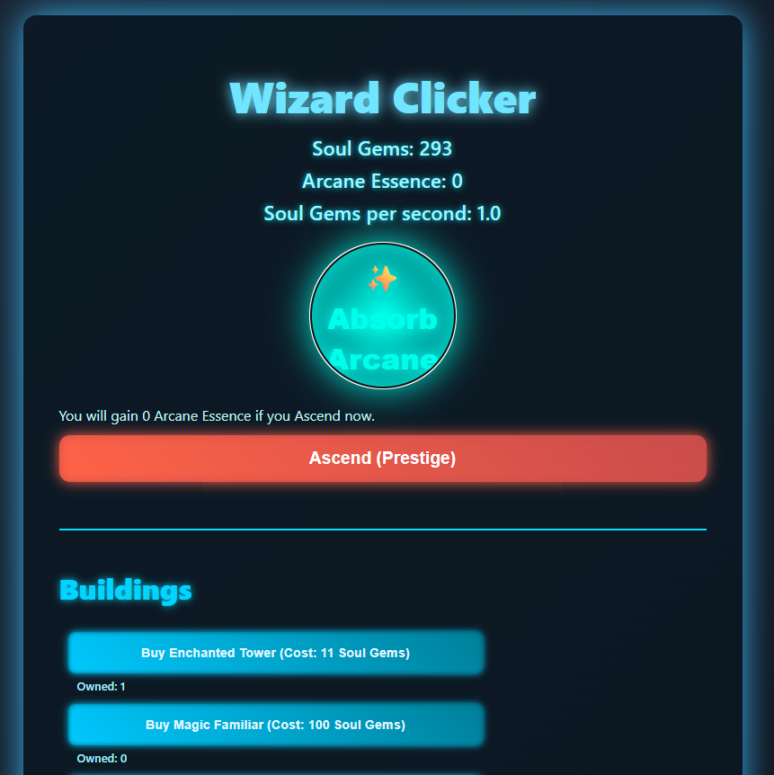

# 🧙‍♂️ Wizard Clicker

**Wizard Clicker** is a browser-based incremental clicker game where you harness arcane power to earn Soul Gems, build magical structures, and ascend through powerful prestige upgrades. Inspired by games like *AdVenture Capitalist*, but with a mystical twist.

 <!-- Optional: replace or remove if no screenshot -->

---

## 🎮 How to Play

- **Click the glowing orb** to generate Soul Gems.
- **Buy magical buildings** to passively generate more Soul Gems over time.
- **Ascend to earn Arcane Essence**, resetting progress but unlocking powerful upgrades.
- **Spend Arcane Essence on permanent upgrades** to accelerate future runs.
- Watch your wizard empire grow exponentially!

---

## 🧱 Features

- Clicker mechanics with exponential scaling
- Passive income from buildings like Enchanted Towers and Magic Familiars
- Prestige system with Arcane Essence
- Upgrade system for click power and production boosts
- Soul Gems per second counter
- Animated UI with glowing effects

---

## 📁 File Structure

```
wizard-clicker/
├── index.html          # Main game HTML
├── style.css           # Game styling and animations
├── game.js             # Core game logic
├── data.js             # Game content (buildings, upgrades)
├── README.md           # You're reading this
```

---

## 🔧 How to Add New Content

To add **new buildings or upgrades**, simply edit `data.js`:

### Add a new building:
```js
{
  id: "manaWell",
  name: "Mana Well",
  baseCost: 500,
  owned: 0,
  production: 10
}
```

### Add a new upgrade:
```js
{
  id: "clickBoost",
  name: "Empower Clicks",
  baseCost: 5,
  level: 0,
  maxLevel: 5,
  effectId: "increaseClickPower"
}
```

Then implement the effect in `applyUpgradeEffect()` in `game.js`.

---

## 📜 License

MIT License — free to use, modify, and share.

---

### ✨ Have fun and may your mana never run dry!
